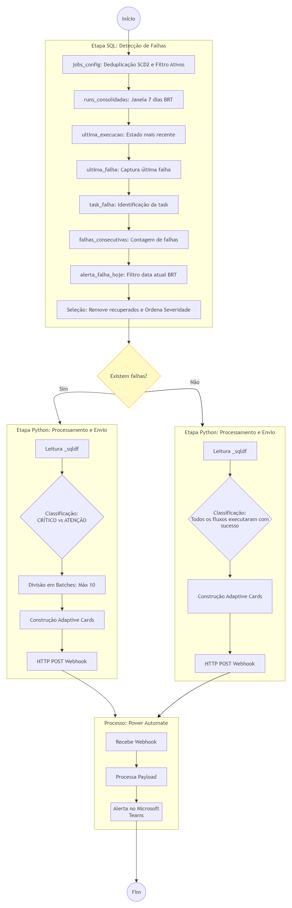

# 🚀 Automação de Monitoramento com Databricks e Power Automate

## 📖 Contexto
O monitoramento de jobs eram realizados manualmente, gerando atrasos e riscos operacionais.

## 🎯 Objetivo
Automatizar o processo de monitoramento e envio de notificações, garantindo maior confiabilidade e agilidade.

---

## 🏗️ Arquitetura

Fluxo:
1. Databricks executa job de monitoramento
2. Gera status de execução
3. Power Automate consome os dados
4. Dispara alertas automáticos

---

## ⚙️ Tecnologias utilizadas

- Databricks (Python / Spark)
- Power Automate
- SQL

---

## 🔄 Processo

### 🔹 Databricks
- Coleta status dos jobs
- Consolida resultados
- Identifica falhas

### 🔹 Power Automate
- Recebe dados via trigger
- Processa informações
- Envia alertas (email / Teams)

---

## 📊 Resultados

- ✅ Redução de tarefas manuais
- ✅ Monitoramento em tempo real
- ✅ Aumento da confiabilidade do processo

---

## 🧠 Aprendizados

- Integração entre ferramentas de dados e automação
- Uso de APIs para comunicação entre sistemas
- Criação de fluxos automatizados escaláveis

---

## 🚀 Melhorias futuras

- Dashboard em Power BI
- Logs estruturados
- Identificação de falhas em tempo real
